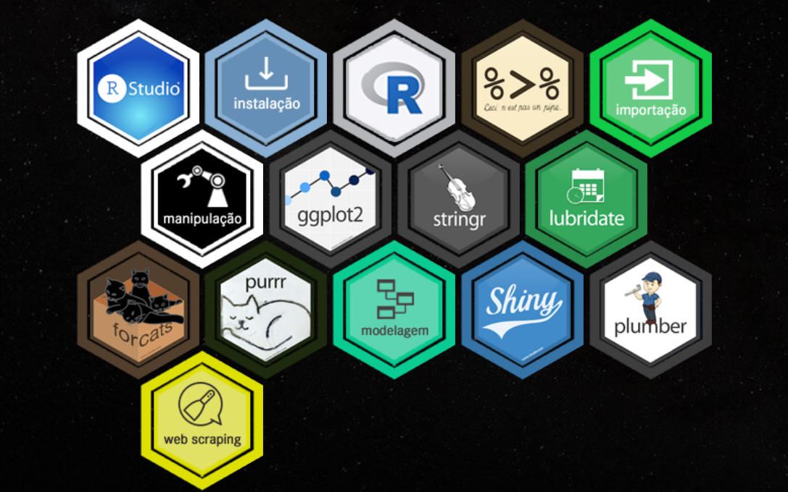

class: middle, center

# Sobre o curso e a Curso-R

---

## Curso-R

<br>

</img>

---

## Professores

</img>

---

## O Curso

* Nosso curso se baseia no livro [R for data science](https://r4ds.had.co.nz).

<br>

Cronograma:

* Introdução

* Manipulação de dados

* Visualização

* Case

---

## Material

* Temos um material em português disponível nesta página:

<center><a href = 'http://material.curso-r.com/'>http://material.curso-r.com/ </a></center>

</img>

---

## Material extra

- Também temos um blog:

<center><a href='http://curso-r.com/blog/'>http://curso-r.com/blog/ </a></center>

<br>

Alguns posts:

- Não use resultados de eleições para avaliar pesquisas eleitorais

- A poluição do ar durante a greve dos caminhoneiros

- Regressão Logística em: a menor deep learning do mundo

- chorrrds: Analisando acordes de músicas brasileiras

---

## Dinâmica das aulas

* Aulas expositivas com exercícios ao decorrer e ao final das aulas.

* Leituras e exercícios complementares fora da sala de aula.

* Parada para café às 21h.

---

class: middle, center

# Introdução

---

## Por que programar?

Fazemos análise de dados no computador

 

---
class: center

# Temos duas principais interfaces

**point & click**


---
class: center

# Temos duas principais interfaces

**point & click**


---
class: center

# Temos duas principais interfaces

**programar**

<br>


---
class: center, middle

### Por que programar é preferível?

<br>

# 1. Código é texto
# 2. Código é legível
# 3. Código é aberto

---
class: middle, center

# Código é texto

Podemos copiar e colar


---
class: middle, center

### Stack Overflow


---
## Código é legível

```{r message=FALSE, warning=FALSE, include=FALSE}
library(magrittr)
library(magick)
library(ggplot2)
library(dplyr)
library(viridis)
```

```{r, eval = FALSE}
image_read("https://jeroen.github.io/images/frink.png") %>%
  image_rotate(270) %>%
  image_background("blue", flatten = TRUE) %>%
  image_border("red", "10x10") %>%
  image_annotate("Liguagens de programação ainda\nsão linguagens!", 
                 color = "white", size = 30)
```

--

.pull-left[

]

--

.pull-right[
```{r, eval = TRUE, echo = FALSE}
image_read("https://jeroen.github.io/images/frink.png") %>%
  image_rotate(270) %>%
  image_background("blue", flatten = TRUE) %>%
  image_border("red", "10x10") %>%
  image_annotate("Liguagens de programação ainda\nsão linguagens!", 
                 color = "white", size = 30)
```
]


---
# Código é aberto

Todas as linguagens de programação modernas são open-source.

### Grátis

- Estudantes podem usar as mesmas ferramentas que os profissionais.
- Todos podem usar as melhores ferramentas independente do poder financeiro.
- Qualquer um pode reproduzir as suas análises.

### Aberto

* Você pode corrigir problemas.
* Você pode desenvolver suas próprias ferramentas.

---

# Por que utilizar o R?

* R é uma linguagem de programação

--

* R foi criado para fazer análise de dados.


--

* R é Open Source

--

* R possui uma comunidade muito ativa de desenvolvedores

---

## Por que usar o R?


---

## Por que usar o R?


---

## Por que usar o R?


O R é a **cola**.

---
class: middle, center

# Case: Análise de Dados de filmes do IMDB

---
class: middle, center

# Ambientação

---
class: center, middle, inverse

```{r setup2, include=FALSE}
options(htmltools.dir.version = FALSE)
```

## Download do R

[Windows](https://cran.r-project.org/bin/windows/base/)
[MacOS](https://cran.r-project.org/bin/macosx/)
[Linux](https://www.digitalocean.com/community/tutorials/how-to-install-r-on-ubuntu-16-04-2)

---
class: center, middle, inverse

## Download do RStudio

[Todas as plataformas](https://www.rstudio.com/products/rstudio/download/#download)

---
class: center, middle, inverse

## O tidyverse

[tidyverse.org](https://www.tidyverse.org)

O tidyverse é um conjunto de pacotes compartilham uma mesma filosofia de desenvolvimento, sintaxe e estruturas de dados.

```{r, eval = FALSE}
install.packages("tidyverse")
library(tidyverse)
```

---
# Vamos ao R!

<br>


---
class: middle, center

# Importação

---

## Ciclo da ciência de dados


---

## O que é importar?


---

## readr

> Diversas funções para ler arquivos de texto

* `read_csv`
* `read_delim`
* `read_csv2`
* `read_log`

---

## Caminho para os arquivos

1. Podem ser relativos ao diretório de trabalho:

```{r}
getwd()
```

```{r, eval = FALSE}
read_csv("/Users/dfalbel/Documents/201807-intro-mastertech/dados.csv")
read_csv("dados.csv")
```

---

## Point and Click

Usar o `Import Dataset` do RStudio.


---

## read_rds

RDS é o formato binário do R.

* write_rds
* read_rds

---

## readxl

> Ler arquivos do excel

* `read_excel`

---

## haven

> Ler arquivos de outros softwares de estatística

* `read_sas`
* `read_spss`
* `read_stata`

---

## DBI + odbc

> Conexão com bancos de dados

* `dbConnect`

[db.rstudio.com](https://db.rstudio.com)

---
class: middle, center

# dplyr

---

## Ciclo da ciência de dados


---
class: middle

```{r setup, include=FALSE}
library(tidyverse)
imdb <- read_rds("../data/imdb.rds")
```

> “Happy families are all alike; every unhappy family is unhappy in its own way.” –– Leo Tolstoy


> “Tidy datasets are all alike, but every messy dataset is messy in its own way.” –– Hadley Wickham

---

## Os 6 verbos do dplyr

* `filter()`: selecionar observações (linhas) da base de dados
* `arrange()`: ordenar de acordo com alguma variável (coluna)
* `select()`: selecionar variáveis (colunas)
* `mutate()`: modificar/criar variáveis do banco de dados
* `summarise()`: sumarizar/agregar variáveis de uma base de dados
* `group_by()`: agrupar pelos valores de alguma variável

---

## 3 regras

* o primeiro argumento é sempre um `data.frame`
* os outros argumentos descrevem o que você quer fazer
* todos os verbos retornam sempre um `data.frame`

Essas três regras fazem o uso do pipe (`%>%`) ser muito intuitivo.

---

## filter

> Selecionar **linhas** da base de dados!

```{r, warning=FALSE}
imdb %>% filter(nota_imdb > 9)
```

---

## filter

> Você pode salvar os resultados em uma outra variável:

```{r, warning=FALSE}
filmes_bons <- imdb %>% filter(nota_imdb > 9)
filmes_bons
```

---

## filter

> Você pode sobreescrever a base também:

```{r}
filmes_bons <- filmes_bons %>% filter(orcamento < 1000000)
filmes_bons
```

---
class: center, middle


---

## arrange

> Ordenar linhas da base de acordo com alguma variável

```{r}
imdb %>% arrange(orcamento)
```

---

## arrange

> Você também pode ordenar na ordem decrescente

```{r}
imdb %>% arrange(desc(orcamento))
```

---

## arrange

> Também é possível ordenar por mais de uma variável:

```{r}
imdb %>% arrange(desc(ano), titulo)
```

---
class: center, middle


---

## select

> Selecionar colunas de uma tabela

```{r}
imdb %>% select(titulo, ano, orcamento)
```

---

## select

> Funções úteis p/ seleção

```{r}
imdb %>% select(starts_with("ator"))
```

---

## select

> Excluir variáveis:

```{r}
imdb %>% select(-starts_with("ator"), -titulo)
```

---

## select

> Outras funções úteis de seleção

* `starts_with("abc")`: seleciona nomes que começam com "abc"

* `ends_with("xyz")`: seleciona nomes que terminam com "xyz"

* `contains("ijk")`: seleciona nomes que contêm "ijk"

* `matches("(.)\\1")`: seleciona nomes usando Expressões Regulares

* `num_range("x", 1:3)`: seleciona x1, x3 e x3

---
class: center, middle


---

## mutate

> Criar ou modificar colunas de um banco de dados.

```{r}
imdb %>% mutate(duracao = duracao/60)
```

---

## mutate

> Criando uma nova variável

```{r}
imdb %>% mutate(duracao_horas = duracao/60)
```


---
class: center, middle


---

## summarise

> Agregar/Sumarisar a tabela

```{r}
imdb %>% summarise(media_orcamento = mean(orcamento, na.rm=TRUE))
```

---

## summarise

> Calcular várias medidas agregadas

```{r}
imdb %>% summarise(
  media_orcamento = mean(orcamento, na.rm=TRUE),
  mediana_orcamento = median(orcamento, na.rm = TRUE)
  )
```

---
class: center, middle


---

## group_by + summarise

> Sumarisar/Agregar a base por grupos

```{r}
imdb %>% group_by(ano)
```

---

## group_by + summarise

> Agregar/Sumarisar por grupos

```{r}
imdb %>% group_by(ano) %>% summarise(qtd_filmes = n())
```

---
class: middle, center


---

## left join

> Tipos de joins


---

## left join

> Chaves duplicadas na tabela da esquerda


---

## left join

> Chaves duplicadas nas duas tabelas


---
class: middle, center


---

## gather

> Transformar variáveis em linhas:


---
class: middle, center


---

## spread

> Transformar linhas em colunas


---
class: middle, center


---
class: middle, center

# ggplot2

---

## O que é?

- Um pacote do R.

- Faz parte do tidyverse.

<br>
<br>

</img>
---

## Origem

- Tese de doutorado do Hadley Wickham.

- Baseado na gramática dos gráficos (*grammar of graphics*) de Leland Wilkinson.

</img>

</img>
---

## Gramática dos gráficos

- Tenta responder a pergunta: o que é um gráfico estatístico?

--

- Um gráfico estatístico é uma representação visual dos dados que utiliza os atributos estéticos (posição, cor, forma, tamanho, ...) de formas geométricas (pontos, linhas, barras, ...).

--

- Com base nessa definição, Hadley desenvolveu a gramática dos gráficos em camadas (ou *layered grammar of graphics*): cada elemento do gráfico pode ser representado por uma camada e um gráfico seria a sobreposição dessas camadas.

</img>

---

## Vale a pena usar?

**Prós**: 

- Dada a filosofia de um gráfico dividido em camadas, a construção é intuitiva e organizada.

- A estrutura é a mesma para todo tipo de gráfico.

- Os gráficos são naturalmente mais bonitos.

--

**Contras**:

- Pode levar algum tempo até a absorção da filosofia de construção por camadas.

- Exige aprender uma nova sintaxe e bastante vocabulário.

--

<br>

**Resposta**: pode apostar que sim!

</img>

---

## Vamos ao RStudio

<br>
<br>


